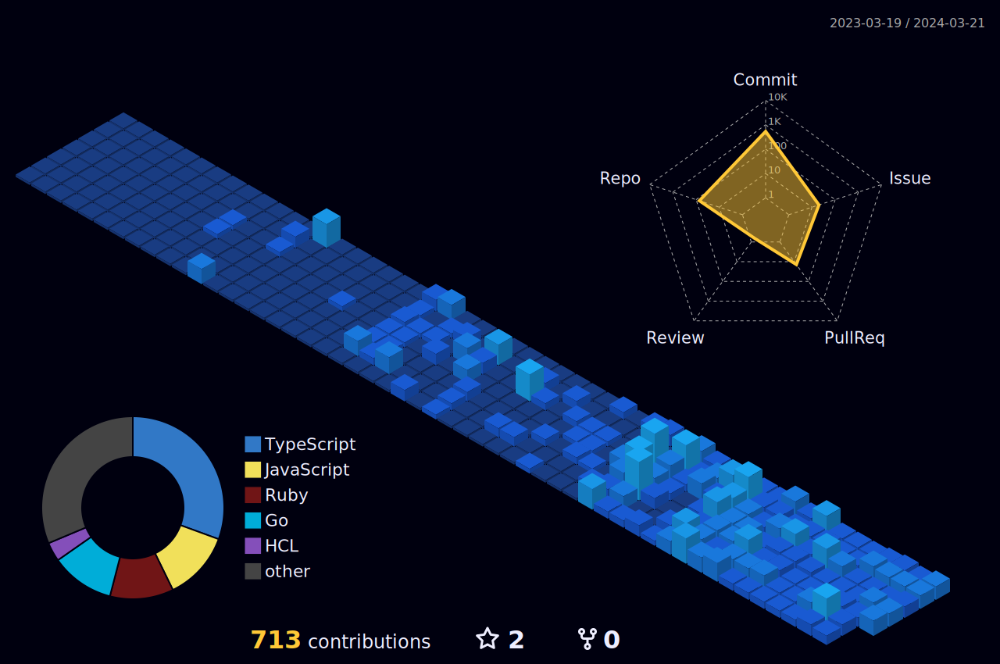

<h1 align="left">Shun Isawa</h1>

I’m SHUN ISAWA

I works as software engineer in Japan

I’m looking to collaborate on Any Open Source Projects as well as personal projects

Check My Resume [Resume Link]()

### How to reach me
- [X](https://twitter.com/dosukoi_org)
- Gmail : isawashundesu@gmail.com

## My Portfolio

## OSS
- first-contribution

## languages

## libraries & frameworks

## tools

## activities

